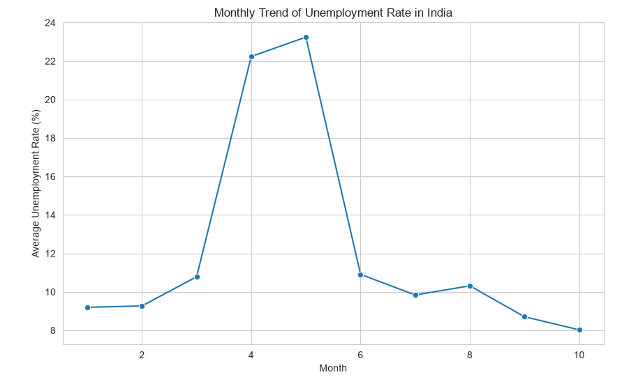
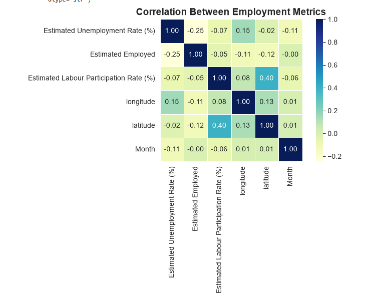
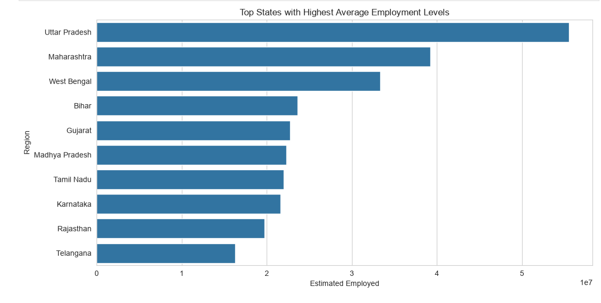
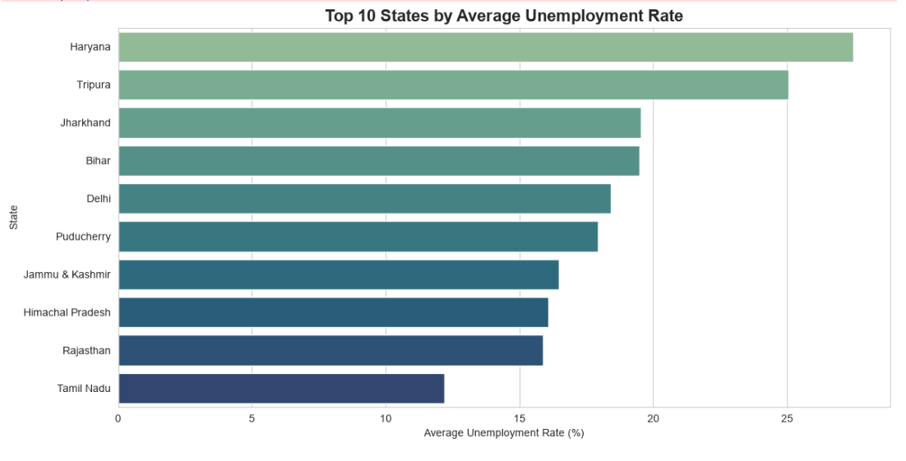
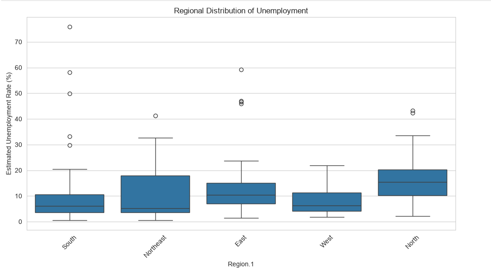

# 📊 Unemployment Analysis in India During COVID-19 using Python


---

# 📌 Project Overview

This project presents an end-to-end **Exploratory Data Analysis (EDA)** of unemployment trends in India during the COVID-19 pandemic. Using Python and powerful data analysis libraries, the project explores how unemployment rates varied across different states and regions, identifies significant trends, and provides data-driven insights that can support policy-level decision-making.

The analysis follows a complete data science workflow, including data cleaning, preprocessing, visualization, statistical exploration, and interpretation of findings.

---

# 🎯 Problem Statement

The COVID-19 pandemic had a significant impact on employment across India, disrupting labour markets and increasing unemployment in several regions.

The objective of this project is to:

- Analyze unemployment trends across Indian states.
- Study the impact of COVID-19 on employment.
- Identify regional disparities in unemployment.
- Discover relationships between employment indicators.
- Generate insights that can support economic planning and policy formulation.

---

# 📂 Dataset Information

The dataset contains unemployment statistics for different Indian states during the COVID-19 period, including:

- State / Region
- Date
- Estimated Unemployment Rate (%)
- Estimated Employed Population
- Labour Participation Rate (%)
- Geographic Region

The dataset provides valuable information for understanding labour market conditions during the pandemic.

---

# 🛠 Technologies Used

- Python
- Pandas
- NumPy
- Matplotlib
- Seaborn
- Jupyter Notebook

---

# 🔄 Project Workflow

```text
Dataset
    │
    ▼
Data Loading
    │
    ▼
Data Cleaning
    │
    ▼
Dataset Quality Assessment
    │
    ▼
Exploratory Data Analysis (EDA)
    │
    ▼
Data Visualization
    │
    ▼
Pattern & Trend Identification
    │
    ▼
Policy Recommendations
```

---

# 📊 Exploratory Data Analysis

The following analyses and visualizations were performed:

- Monthly Unemployment Trend
- State-wise Unemployment Analysis
- Regional Unemployment Analysis
- Employment Distribution
- Labour Participation Rate Distribution
- Correlation Heatmap
- Top 10 States by Average Unemployment Rate
- COVID-19 Impact Analysis

---

# 📈 Key Findings

- Northern states recorded comparatively higher unemployment rates during the pandemic.
- Haryana experienced the highest average unemployment among the analyzed states.
- Significant regional disparities in unemployment were observed across India.
- Labour participation and employment levels varied considerably between states.
- COVID-19 had a measurable impact on India's labour market, particularly during lockdown periods.

---

# 💼 Policy Recommendations

Based on the analysis, the following recommendations can support employment recovery:

- Prioritize employment generation programs in high-unemployment states.
- Strengthen skill development and vocational training initiatives.
- Implement region-specific labour market policies.
- Increase investments in industries with high employment potential.
- Continuously monitor employment indicators for early policy intervention.

---

# 📷 Project Visualizations

## Monthly Unemployment Trend



---

## Correlation Heatmap



---

## Regional Unemployment Analysis



---

## Top 10 States by Average Unemployment Rate



---

## Employment Distribution



---

# 💡 Business Insights

The analysis highlights substantial regional differences in unemployment across India. States such as Haryana and Tripura consistently exhibited higher unemployment levels, whereas several western states demonstrated comparatively better employment stability.

These findings suggest that economic shocks affect regions differently, emphasizing the need for targeted employment policies instead of uniform nationwide strategies.

---

# 📁 Project Structure

```text
UNEMPLOYMENT_ANALYSIS
│
├── Unemployment_Analysis.ipynb
├── Unemployment_Rate_upto_11_2020.csv
├── README.md
├── requirements.txt
├── Monthly_Unemployment_Trend.png
├── Correlation_Heatmap.png
├── Regional_Unemployment.png
├── Top10_States_Unemployment.png
└── Employment_Distribution.png
```

---

# 🚀 How to Run

Clone the repository:

```bash
git clone https://github.com/YOUR_USERNAME/unemployment_analysis_python.git
```

Install the required libraries:

```bash
pip install -r requirements.txt
```

Open the notebook:

```text
unemployment_analysis_python.ipynb
```

Run all cells sequentially.

---

# 🔮 Future Improvements

- Build an interactive Power BI dashboard.
- Forecast unemployment trends using Time Series models.
- Develop predictive Machine Learning models for unemployment estimation.
- Deploy an interactive dashboard using Streamlit.
- Compare post-COVID and pre-COVID employment trends.

---

# 🎓 Learning Outcomes

Through this project, I gained practical experience in:

- Data Cleaning & Preprocessing
- Exploratory Data Analysis (EDA)
- Statistical Data Analysis
- Data Visualization
- Correlation Analysis
- Business Insight Generation
- Policy-Oriented Data Interpretation
- GitHub Project Documentation

---

# 👩‍💻 Author

**Diya Arjnani**

Engineering Student | Aspiring Data Analyst | Machine Learning Enthusiast

If you found this project useful, consider ⭐ starring the repository.
